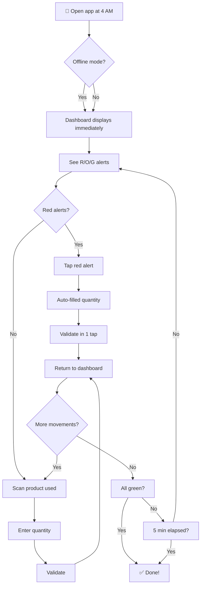
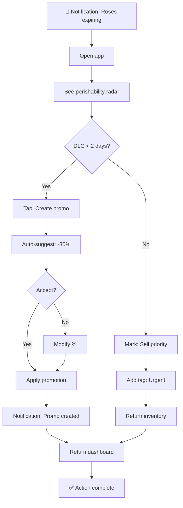
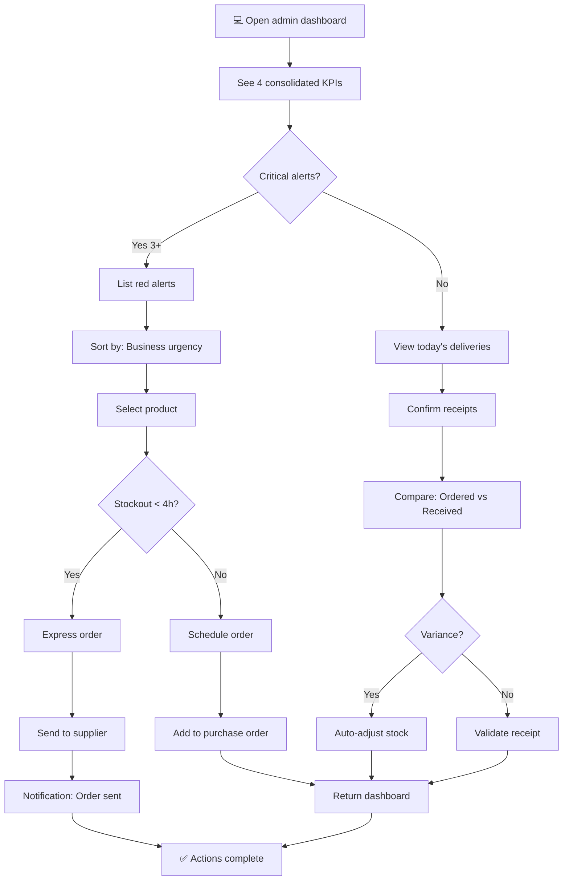
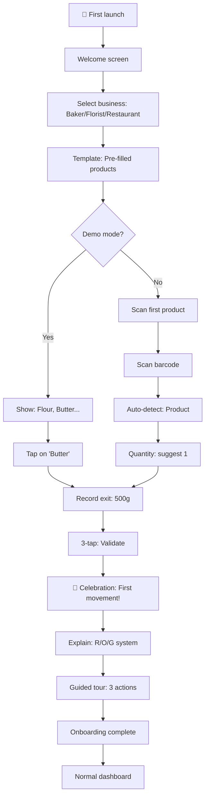

# UX Design Specification gestionnaire-stock

**Author:** Sokoshy
**Date:** 2026-02-02

---

<!-- UX design content will be appended sequentially through collaborative workflow steps -->

## Executive Summary

### Project Vision

StockZen transforms inventory management from a dreaded daily chore into a fluid and intuitive experience. Our mission is to give small merchants peace of mind through a "3-click maximum" interface, an intelligent visual alert system (R/O/G), and proactive predictions that anticipate stockouts before they happen.

### Target Users

**Bernard - The Artisan Baker (~40 years old)**
- Family business structure, works 6 days/week from 4 AM to 6 PM
- Manages 20-50 products (flour, butter, perishable eggs)
- Critical needs: Absolute speed, offline mode, morning alerts
- Context: No WiFi at 4 AM, hands covered in dough

**Fleur - The Solo Florist (~25 years old)**
- Individual business, creativity first
- Complex management: highly perishable cut flowers, pots, seasonal events
- Critical needs: Extreme simplicity, expiration alerts, event suggestions
- Context: Hates paperwork, works with her hands

**Marc - The Organized Restaurateur (~38 years old)**
- 35-seat restaurant, 4 employees, 18 different suppliers
- Daily multi-delivery management (6 AM - 10 AM)
- Critical needs: Consolidated supplier view, waste reduction (currently 15-20%), real-time alerts
- Context: High-pressure service, can never tell a customer "we're out"

### Key Design Challenges

1. **Minimal Friction (3 Clicks Maximum)**
   - Reduce management time from 30 min/day to 5-10 min
   - 80-90% of actions must be achievable in max 3 clicks
   - Ultra-fast workflow for stock entries and exits

2. **Contextual Accessibility (Offline-First)**
   - 100% offline mode essential for Bernard at 4 AM
   - Automatic transparent sync when WiFi returns
   - Interface usable with occupied hands (large touch targets)

3. **Stress Reduction (Peace of Mind Index)**
   - Shift from reactive ("you're out of stock") to proactive ("in 3 days...")
   - Measurable Peace of Mind Index (PMI) > 80/100
   - Reassuring dashboard showing total control of the situation

4. **Multi-Contexts (Same App, Different Needs)**
   - Bernard: Ultra-simple, 3 main buttons
   - Marc: Manageable complexity, multi-suppliers, permissions
   - Intelligent adaptation based on user profile

### Design Opportunities

1. **Emotional Differentiation**
   - Positioning: "Sell serenity, not software"
   - User experience that reduces stock-related anxiety
   - Design "that makes you want to spend time on it" vs ugly functional ERPs

2. **Visual Intelligence (R/O/G System)**
   - Unique innovation: Prioritization by business criticality (inspired by Uber)
   - Red: critical (major impact if stockout)
   - Orange: attention (prevention needed)
   - Green: healthy (no action required)
   - Immediate cognitive reduction - user knows what to do in 1 second

3. **"In 3 Days" Predictions**
   - Paradigm shift: Netflix anticipates → StockZen anticipates your stockouts
   - Algorithm based on consumption history
   - Competitive advantage: no competitor offers this in this segment
   - Business value: "In 3 days you'll be out of stock" vs "You're out of stock"

4. **Versatile Mobile-First Design**
   - Smartphone for Bernard (pocket during production)
   - Tablet for Fleur (client presentation)
   - Desktop for Marc (administrative management)
   - Fluid responsive 320px → 1920px with touch optimizations

## Core User Experience

### Defining Experience

**Core User Action: Stock Movement Recording (3-Click Maximum)**

The single most critical interaction in StockZen is recording a stock entry or exit in maximum 3 clicks. This action represents 80% of daily usage and must be absolutely effortless:

**The 3-Click Core Loop:**
1. **Tap** - Select product (scan barcode or tap from dashboard)
2. **Enter** - Input quantity (numeric keypad, large touch targets)
3. **Confirm** - Validate movement (single tap, instant feedback)

This loop must complete in under 10 seconds, even with offline connectivity.

**Why This Matters:**
- Bernard records 15-20 movements daily at 4 AM with flour-covered hands
- Fleur deducts flowers while creating bouquets with customers waiting
- Marc's staff records ingredients during lunch service under pressure

**Competitive Advantage:**
While competitors require 8-12 clicks (navigate → find product → select action → enter quantity → confirm → sync → return), StockZen achieves the same in 3 clicks maximum.

### Platform Strategy

**Primary Platform: Progressive Web App (PWA) - Mobile-First**

**Platform Decisions:**

1. **Mobile-First Responsive Design**
   - Smartphone (320px+): Bernard's primary device - pocket during production
   - Tablet (768px+): Fleur's presentation device - counter-top with customers
   - Desktop (1024px+): Marc's admin interface - multi-supplier management

2. **Offline-First Architecture (Critical Requirement)**
   - 100% functionality without internet connection
   - Local data storage with automatic cloud sync
   - Conflict resolution: "last modified wins" strategy
   - Visual sync status indicator (green/orange/red)

3. **Progressive Web App (PWA)**
   - Installable on all devices without app store friction
   - Native-like experience with push notifications
   - Auto-update without user intervention
   - Cross-platform consistency (iOS/Android/Desktop)

4. **Device Capabilities Leveraged**
   - Camera barcode scanning (Phase 2)
   - Push notifications for critical alerts
   - Biometric authentication (Face ID/Touch ID)
   - Haptic feedback for confirmations

### Effortless Interactions

**Areas Where StockZen Eliminates Friction:**

1. **Zero-Navigation Dashboard**
   - Alert list appears immediately on app open
   - No menu navigation required for daily tasks
   - R/O/G color coding provides instant priority understanding
   - "What needs my attention right now?" answered in 1 second

2. **Smart Defaults & Auto-Configuration**
   - Pre-configured criticality levels by product category
   - Suggested thresholds based on historical consumption
   - Auto-categorization by supplier or product type
   - No blank slate - start managing immediately

3. **Invisible Synchronization**
   - Offline entries sync automatically when connection returns
   - No "sync now" buttons or manual actions required
   - Conflict resolution happens silently with clear notifications
   - Bernard never thinks about connectivity - it just works

4. **Contextual Input Optimization**
   - Large numeric keypad for quantity entry (gloves-friendly)
   - Barcode scanning with instant product recognition
   - Recent products appear first (intelligent sorting)
   - Voice input option for hands-free operation (Phase 2)

5. **Eliminated Steps (vs Competition)**
   - No manual category navigation (smart defaults)
   - No separate "save" action (auto-save on confirmation)
   - No explicit logout/login (persistent session with biometric)
   - No manual threshold calculations (auto-suggested based on history)

### Critical Success Moments

**Make-or-Break User Experience Moments:**

1. **First Success Moment (Day 1): First Stock Recording**
   - Target: Complete first entry in < 30 seconds
   - Success: User thinks "This is actually simple!"
   - Failure: User returns to Excel/spreadsheet
   - Key: Immediate onboarding with pre-populated example products

2. **Second Success Moment (Week 1): First Proactive Alert**
   - Target: Alert prevents a stockout that would have happened
   - Success: User experiences "Aha! It thinks for me"
   - Failure: Alert is too late or inaccurate
   - Key: "In 3 days you'll be out of flour" vs "You're out of flour"

3. **Third Success Moment (Week 2): Daily Time Reduction**
   - Target: Daily update time < 5 minutes (vs 30 min before)
   - Success: User feels relief and regained time
   - Failure: Process still feels tedious
   - Key: 3-click maximum validation, dashboard efficiency

4. **Fourth Success Moment (Month 1): Peace of Mind Realization**
   - Target: PMI (Peace of Mind Index) > 80/100
   - Success: User sleeps better, checks app proactively without stress
   - Failure: User still wakes up worried about stock levels
   - Key: Proactive alerts, confident dashboard, zero surprises

5. **Long-term Success Moment (Month 3+): Tool Dependency**
   - Target: User reports "I can't work without it anymore"
   - Success: StockZen becomes integral part of business operations
   - Failure: User sees it as "just another tool"
   - Key: Measurable ROI (time saved, waste reduced, stockouts eliminated)

### Experience Principles

**Guiding Principles for All UX Decisions:**

1. **"3 Clicks Maximum" - Radical Simplicity**
   - If an action requires more than 3 clicks, the design has failed
   - Eliminate, don't organize - remove steps rather than creating better menus
   - Every click must provide clear value to the user
   - When in doubt, remove features rather than add complexity

2. **"Zero Cognitive Load" - Visual Intelligence**
   - R/O/G system provides instant understanding without reading
   - Dashboard answers "What do I do now?" in 1 second
   - No mental math, no threshold calculations, no decision fatigue
   - Design for the 4 AM brain - tired, rushed, distracted

3. **"Offline is the Default" - Contextual Accessibility**
   - App must work flawlessly without internet (Bernard at 4 AM in the bakery)
   - Sync happens invisibly - user never thinks about connectivity
   - Design for hands covered in flour, gloves, or water
   - Large touch targets, clear contrast, no hover states

4. **"Proactive, Not Reactive" - Predictive Peace of Mind**
   - Alert users before problems occur ("In 3 days..." vs "You're out")
   - Anticipate needs based on patterns and context
   - Transform anxiety into confidence
   - The product should feel like a trusted assistant, not a monitoring tool

5. **"Emotional Design" - Serenity Through UX**
   - Beautiful interface that users enjoy looking at (vs "functional but ugly" ERPs)
   - Micro-delights: satisfying animations, haptic feedback, celebration moments
   - Design reduces stress, doesn't add to it
   - Every interaction should increase the Peace of Mind Index

## Desired Emotional Response

### Primary Emotional Goals

**Core Emotional Objective: Peace of Mind / Serenity**

The primary emotional goal for StockZen is to transform inventory management from a source of stress into a moment of reassurance. Users should feel **calm and in control** when checking their stock levels, experiencing what we measure as the "Peace of Mind Index" (PMI).

**Supporting Emotional Goals:**

- **Confidence**: Users trust that the system has their back and won't let them down. The app feels reliable and predictable, never surprising them with unexpected failures or data loss.

- **Efficiency**: Users feel productive and accomplished after completing their quick 5-minute daily updates. The speed creates satisfaction and reinforces the value proposition.

- **Delight**: Small moments of surprise and satisfaction throughout the experience - smooth animations, smart predictions that come true, haptic feedback on confirmations.

- **Empowerment**: Users feel like they have superpowers to anticipate and prevent problems. The proactive alerts give them control over situations that previously caused anxiety.

### Emotional Journey Mapping

**Discovery Phase:**
- **Curious and hopeful**: "Could this finally solve my stock headaches?"
- **Skeptical but intrigued**: "Another app, but this one seems different with its 3-click promise"

**First Use (Onboarding):**
- **Surprised by simplicity**: "Wait, that's it? Just 3 clicks?"
- **Encouraged**: "I can actually do this, even at 4 AM with flour on my hands"

**Daily Usage:**
- **Calm and efficient**: Quick morning check becomes a smooth routine
- **In control**: Dashboard shows everything important at a single glance
- **Relieved**: Alerts arrive before problems occur, not after the damage is done

**Success Moments:**
- **Triumphant**: First proactive alert successfully prevents a stockout
- **Grateful**: "This saved me from disappointing a regular customer"
- **Confident**: "I've got this handled, no more surprises"

**Long-term Relationship:**
- **Dependent (positive)**: "Can't imagine running my business without it"
- **Proud**: Recommending StockZen to fellow merchants and colleagues
- **Peaceful**: Sleeping soundly knowing stock management is under control

### Micro-Emotions

**Critical Emotional States to Cultivate:**

**Confidence vs. Confusion**
- Clear visual hierarchy (R/O/G system) eliminates ambiguity
- Smart defaults reduce decision fatigue and second-guessing
- Consistent patterns users can rely on

**Trust vs. Skepticism**
- Accurate predictions build reliability over time
- Offline functionality "just works" without user intervention
- Data integrity and zero-loss sync create faith in the system

**Accomplishment vs. Frustration**
- Quick task completion (3 clicks) creates immediate satisfaction
- Progress indicators celebrate small wins
- Visual feedback confirms successful actions

**Delight vs. Satisfaction**
- Smooth micro-interactions (haptic feedback, subtle animations)
- "In 3 days" predictions feel magical when they come true
- Smart defaults that anticipate user needs

**Emotions to Actively Avoid:**

- **Anxiety** (except as healthy motivation to act on red alerts)
- **Overwhelm** from too many options or complex navigation
- **Distrust** from inaccurate alerts or data loss fears
- **Frustration** from slow performance or confusing user flows
- **Panic** from poorly designed critical alert presentations

### Design Implications

**Connecting Emotions to Specific UX Choices:**

**Serenity → Clean, Minimal Interface**
- Generous whitespace and simple typography reduce visual noise
- Calming color palette (not aggressive reds dominating the screen)
- Smooth, non-jarring transitions between screens
- No unnecessary decorative elements that add cognitive load

**Confidence → Predictable, Reliable Behaviors**
- Consistent interaction patterns throughout the entire app
- Clear visual and haptic feedback for every user action
- Accurate, timely alerts that prove the system understands their business
- Transparent sync status that removes uncertainty

**Efficiency → Optimized for Speed**
- Large touch targets designed for flour-covered or gloved hands
- Smart defaults that eliminate configuration time
- Recent items prioritized to reduce searching
- Offline mode that never blocks the user

**Delight → Micro-interactions and Smart Features**
- Satisfying haptic feedback on confirmations (gentle, not jarring)
- Celebratory micro-animations when tasks complete successfully
- "Aha!" moments when predictions prove accurate
- Voice input for hands-free operation (Phase 2)

**Empowerment → Visibility and Control**
- Dashboard shows all critical information at a single glance
- Customizable thresholds and alert preferences
- Clear history and audit trails for accountability
- Multi-site views for growing businesses

### Emotional Design Principles

**Guiding Principles for Creating the Right Feelings:**

1. **"Calm in the Storm" Design**
   - Even when displaying critical red alerts, maintain an overall calm aesthetic
   - Urgent information presented clearly without panic-inducing visuals
   - Users should feel the product helps them handle problems, not adds to their stress
   - Red alerts should motivate action, not create anxiety

2. **"Invisible Assistant" Presence**
   - The app should feel like a trusted partner, not a monitoring tool or surveillance system
   - Proactive help delivered without being intrusive or demanding attention
   - Smart predictions that demonstrate deep understanding of the user's business
   - Automation that feels helpful, not controlling

3. **"Daily Satisfaction" Moments**
   - Every interaction should end with a sense of accomplishment
   - Progress indicators showing task completion
   - Time saved should feel tangible and measurable
   - Small celebrations for consistent usage streaks

4. **"Zero Anxiety" Promise**
   - Eliminate data loss fears through reliable sync and automatic backups
   - Remove "what if I mess up" worries with easy corrections and undo options
   - Eliminate connectivity stress through flawless offline functionality
   - Clear error messages that offer solutions, not just problems

5. **"Professional Serenity" Aesthetic**
   - Beautiful enough that users enjoy opening the app daily
   - Modern design that starkly contrasts with ugly legacy ERP solutions
   - Visual polish that reflects the quality users put into their own businesses
   - Typography and spacing that convey competence and trustworthiness

## UX Pattern Analysis & Inspiration

### Inspiring Products Analysis

**Uber - Visual Priority System**
- **Core UX Success**: Intelligent color-coding (ride status) that instantly communicates urgency without reading
- **Why It Works**: Cognitive reduction - users immediately know what action to take
- **Key Insight**: Visual prioritization beats textual descriptions every time
- **StockZen Application**: R/O/G alert system for stock criticality

**Netflix - Proactive Predictions**
- **Core UX Success**: "Because you watched..." - anticipating needs before users express them
- **Why It Works**: Creates feeling of intelligence and deep understanding
- **Key Insight**: Shift from reactive to proactive transforms user relationship
- **StockZen Application**: "In 3 days" predictions based on consumption history

**Notion - Hidden Simplicity**
- **Core UX Success**: Minimalist interface that masks underlying power
- **Why It Works**: Starts simple, becomes more powerful with usage
- **Key Insight**: Progressive disclosure prevents overwhelm for new users
- **StockZen Application**: 3-click workflow for beginners, advanced features for power users

**Todoist - Effortless Task Management**
- **Core UX Success**: Ultra-fast task entry with natural language syntax
- **Why It Works**: Zero friction in the primary user action
- **Key Insight**: Primary action must be optimized to the extreme
- **StockZen Application**: Stock movement recording in 3 clicks maximum

**Strava - Subtle Gamification**
- **Core UX Success**: Celebrating small wins without being intrusive
- **Why It Works**: Reinforces habit formation and satisfaction
- **Key Insight**: Positive reinforcement increases retention
- **StockZen Application**: Celebrations when targets met, usage streaks

### Transferable UX Patterns

**Navigation Patterns:**

- **Dashboard-First Architecture** (from Uber)
  - Critical information visible immediately upon app open
  - No navigation required for daily status check
  - Applies to: Bernard's 4 AM quick check workflow

- **3-Click Maximum** (from Todoist)
  - Any primary action completable in maximum 3 steps
  - Eliminates decision fatigue and cognitive load
  - Applies to: Stock entry/exit recording for all personas

- **Context-Aware Navigation** (from Notion)
  - Navigation adapts to user role and usage patterns
  - Different views for different personas
  - Applies to: Bernard (simple) vs Marc (administrative) interfaces

**Interaction Patterns:**

- **Swipe Actions** (from Gmail)
  - Quick actions on list items without opening detail view
  - Large touch targets for hands with gloves/flour
  - Applies to: Stock movement recording from dashboard

- **Smart Defaults** (from Notion)
  - Pre-filled intelligent values based on context
  - Reduces setup time to near zero
  - Applies to: Threshold suggestions, category auto-assignment

- **Invisible Sync** (from Figma)
  - 100% offline functionality with seamless cloud sync
  - No manual sync actions required
  - Applies to: Bernard's offline bakery workflow

**Visual Patterns:**

- **R/O/G Status System** (from Uber)
  - Business-critical color coding for instant understanding
  - Red = immediate action, Orange = prepare, Green = healthy
  - Applies to: Stock level alerts across all interfaces

- **Calm Aesthetic** (from Headspace)
  - Soothing design that reduces anxiety despite alerts
  - Clean whitespace, soft colors, no visual clutter
  - Applies to: Overall visual design language

- **Micro-Interactions** (from Stripe)
  - Subtle, satisfying feedback for user actions
  - Haptic feedback, smooth transitions, completion celebrations
  - Applies to: Confirmation animations, success states

### Anti-Patterns to Avoid

**Anti-Pattern 1: Complex Hamburger Navigation**
- **Problem**: Hides important features behind menus (common in legacy ERPs)
- **Impact**: Users can't find what they need, abandonment increases
- **Why Avoid**: Bernard needs immediate visibility at 4 AM, no time to navigate
- **StockZen Solution**: Dashboard-first with contextual navigation

**Anti-Pattern 2: Alert Fatigue**
- **Problem**: Too many non-actionable notifications (common in monitoring apps)
- **Impact**: Users ignore all alerts, including critical ones
- **Why Avoid**: Would destroy the Peace of Mind Index promise
- **StockZen Solution**: R/O/G system with strict prioritization, only actionable alerts

**Anti-Pattern 3: Blank Slate Terror**
- **Problem**: Empty starting state with no guidance (like blank Excel)
- **Impact**: Users don't know where to start, feel overwhelmed
- **Why Avoid**: Fleur hates paperwork, needs immediate direction
- **StockZen Solution**: Pre-populated examples, smart defaults, industry templates

**Anti-Pattern 4: Anxious Sync Indicators**
- **Problem**: Prominent "Synchronizing..." messages that create data anxiety
- **Impact**: Users worry about data integrity and reliability
- **Why Avoid**: Creates stress opposite to Peace of Mind goal
- **StockZen Solution**: Invisible sync with subtle status indicator only when needed

**Anti-Pattern 5: Feature Bloat**
- **Problem**: Too many features creating impossible learning curve (Odoo/SAP)
- **Impact**: Users abandon due to complexity, use only 10% of features
- **Why Avoid**: Target users are small merchants, not enterprise
- **StockZen Solution**: MVP focused on 3 core actions, advanced features progressively disclosed

### Design Inspiration Strategy

**What to Adopt:**

1. **R/O/G Priority System** (from Uber)
   - **Strategy**: Implement exactly as inspiration for stock alerts
   - **Rationale**: Proven pattern for instant visual prioritization
   - **Implementation**: Red (critical/immediate action), Orange (prepare/attention), Green (healthy/no action)
   - **Success Metric**: User understands priority in < 1 second without reading

2. **Predictive Intelligence** (from Netflix)
   - **Strategy**: Adopt the paradigm shift from reactive to proactive
   - **Rationale**: Creates competitive advantage and user delight
   - **Implementation**: "In 3 days you'll be out" instead of "You're out"
   - **Success Metric**: 70%+ prediction accuracy creates trust

3. **Effortless Core Action** (from Todoist)
   - **Strategy**: Optimize the 3-click maximum philosophy relentlessly
   - **Rationale**: Primary action represents 80% of daily usage
   - **Implementation**: Every stock movement in exactly 3 taps
   - **Success Metric**: Average time per movement < 10 seconds

**What to Adapt:**

1. **Progressive Disclosure** (from Notion)
   - **Strategy**: Adapt the concept for role-based feature revelation
   - **Modification**: Start with 3-button interface for all, reveal advanced features based on usage patterns
   - **Rationale**: Different personas need different complexity levels
   - **Implementation**: Bernard sees only essentials, Marc unlocks admin features

2. **Calm Professional Design** (from Headspace + utility apps)
   - **Strategy**: Adapt soothing aesthetic for professional business context
   - **Modification**: Calm but professional, not "too zen" or playful
   - **Rationale**: Users are business owners, not meditation practitioners
   - **Implementation**: Soft grays with strategic color for alerts only

**What to Avoid:**

1. **Over-Gamification**
   - **Strategy**: Resist adding badges, points, leaderboards
   - **Rationale**: Merchants want serenity, not distractions
   - **Alternative**: Subtle celebrations only for real accomplishments (zero stockouts, time saved)

2. **Social Features**
   - **Strategy**: No sharing, social feeds, or community features
   - **Rationale**: Inventory management is private and professional
   - **Alternative**: Focus on individual productivity and business insights

3. **Complex Setup Wizards**
   - **Strategy**: No multi-step configuration process
   - **Rationale**: Users should start managing immediately
   - **Alternative**: Smart defaults with optional advanced configuration

## Core User Experience

### Defining Experience

**The Defining Interaction: "Record a stock movement in 3 clicks, even at 4 AM without WiFi"**

This is the core experience that makes StockZen special - the one interaction that, if perfected, makes everything else follow naturally. It's the "swipe right" of inventory management.

**Why This is the Defining Experience:**

1. **Frequency**: Bernard performs this action 15-20 times daily at 4 AM - it's his primary workflow
2. **Context**: Fleur does it between bouquets with waiting customers - must be instant
3. **Pressure**: Marc's staff does it during lunch service - no room for error or delay
4. **Impact**: If this interaction is effortless, users feel the product "just works"

**What Users Will Tell Their Colleagues:**
- "I record my stock in 3 clicks, it's ridiculously simple"
- "Even without internet in my bakery, it works perfectly"
- "I finished my management in 5 minutes this morning, used to take 30 minutes"

**The Promise:** Transform a dreaded 30-minute daily chore into a effortless 5-minute routine that happens naturally.

### User Mental Model

**Current Mental Models (Before StockZen):**

**Excel/Paper Systems:**
- Mental model: "I have to remember everything, calculate myself, no alerts"
- Emotional state: Anxiety, fear of forgetting, stress about mistakes
- Behavior: Procrastinate until critical, then panic-check everything

**Complex ERP Systems (Odoo/SAP):**
- Mental model: "Too many menus, 10+ clicks to do anything, I get lost"
- Emotional state: Frustration, feeling incompetent, dread using the system
- Behavior: Avoid using it, do minimum required, maintain parallel paper system

**Result:** Inventory management is a source of stress, not a business tool.

**Target Mental Model (With StockZen):**

**"It's Like a Smart Post-it Note"**
- Familiar simplicity of jotting something down
- But with intelligence: automatic calculations, alerts, predictions
- Feels natural and obvious, not "computery"

**"The App Thinks For Me"**
- Confidence that the system understands their business
- Trust in predictions and alerts
- Feeling of having a smart assistant, not just a database

**"I Control Everything at a Glance"**
- Dashboard as a business control panel
- Immediate understanding of status without digging
- Sense of mastery and control over operations

**User Expectations:**
- **Immediate**: Open app → see alerts → act if needed (no navigation)
- **Natural**: No learning curve, interface follows business logic
- **Reliable**: Never surprises, always relevant, works offline
- **Fast**: Under 10 seconds per transaction, 5 minutes total daily

### Success Criteria

**How We Know the Core Experience Succeeds:**

**1. "It Just Works" Indicators:**
- 80% of movements recorded in exactly 3 clicks
- Average time per movement: < 10 seconds
- Zero frustration during recording (measured by rage clicks, abandonments)
- 100% offline functionality (never blocked by connectivity)

**2. "I Feel Smart" Indicators:**
- Predictions "In 3 days" are accurate > 70% of the time
- R/O/G alerts genuinely match business urgency (user validation)
- User anticipates problems before they occur (proactive behavior)
- Peace of Mind Index (PMI) > 80/100

**3. "I Can't Work Without It" Indicators:**
- Daily usage becomes automatic habit within 21 days
- Returning to old methods = immediate frustration
- Active recommendation to other merchants (word-of-mouth)
- Tool dependency score > 4/5 in user surveys

**Quantitative Success Metrics:**

| Metric | Target | Measurement Method |
|--------|--------|-------------------|
| Daily update time | 5 minutes (down from 30) | In-app time tracking |
| Clicks per movement | Exactly 3 for 80% of actions | Interaction analytics |
| Error rate | < 2% | Data validation logs |
| Offline success rate | 100% | Sync logs analysis |
| Recording satisfaction | 4.5+/5 | Post-action micro-survey |
| Task completion time | < 10 seconds average | Performance analytics |
| Feature adoption | 90% use 3-click workflow | Feature usage tracking |

### Novel UX Patterns

**Established Patterns We Adopt (No User Education Needed):**

1. **List Selection** (like any mobile app)
   - Tap to select from list of products
   - Familiar pattern, zero learning curve

2. **Numeric Keypad** (like calculator)
   - Full-screen numeric input for quantities
   - Natural for counting inventory

3. **Swipe Actions** (like Gmail, iOS Mail)
   - Quick actions on list items
   - Delete, edit, or mark complete with swipe

4. **Card UI** (like Trello, Notion)
   - Information organized in visual cards
   - Easy to scan, clear hierarchy

**Novel Patterns We Must Teach:**

1. **R/O/G Business-Critical System**
   - Not just "low stock" but "business impact criticality"
   - Red = immediate revenue impact if stockout
   - Orange = prepare for upcoming need
   - Green = healthy, no action required
   
   **Teaching Strategy:**
   - Day 1: Show colors without explanation, let users observe
   - Week 1: Colors become self-evident through usage
   - Week 2: User validates "Red really means urgent for my business"

2. **Temporal Predictions ("In 3 Days")**
   - Shift from "stock level" to "time until stockout"
   - Novel concept: "You will be out in 3 days at current pace"
   
   **Teaching Strategy:**
   - First prediction appears naturally in Week 1
   - When it proves accurate: "Aha!" moment of trust
   - Becomes core value proposition users mention to others

3. **Invisible Offline Mode**
   - Novel: App works 100% same with or without internet
   - No visual difference, no user action required
   
   **Teaching Strategy:**
   - User discovers this accidentally (works in basement/no-WiFi zone)
   - Creates surprise and delight
   - Differentiator competitors don't have

**Our Unique Twist:**

Combining **extreme simplicity** (3 clicks) with **predictive intelligence** (anticipation). No competitor offers both simultaneously - they either:
- Are simple but dumb (basic alerts)
- Are intelligent but complex (ERP predictions)

**Pattern Innovation Strategy:**
- Start with familiar patterns (comfortable)
- Introduce novel concepts gradually (Week 1-2)
- Let users discover value through experience, not tutorials

### Experience Mechanics

**Detailed Flow: "Record a Stock Movement"**

#### Phase 1: Initiation (0.5 seconds)

**Entry Points:**
1. **Dashboard Alert** (most common)
   - User opens app → sees R/O/G alerts
   - Taps alert card → product pre-selected
   - Ready for quantity input immediately

2. **Product List**
   - Scroll list → tap product
   - Recent products at top (smart sorting)
   - Search/filter if needed (rare)

3. **Barcode Scan** (Phase 2)
   - Tap scan button → camera opens
   - Auto-recognition → product selected
   - Quantity input ready

**Visual Design:**
- No loading states, instant response
- Large touch targets (44x44px minimum)
- Clear visual hierarchy: Alerts → Recent → All Products

#### Phase 2: Interaction (3-5 seconds)

**The 3-Click Sequence:**

**Click 1: Product Selection**
- Tap product card or alert
- Haptic feedback: light pulse
- Screen transitions to quantity input
- Product name and current stock displayed prominently

**Click 2: Quantity Entry**
- Large numeric keypad appears (full screen on mobile)
- Current stock shown for reference
- Large buttons (60px+) for flour-covered fingers
- Quick +/- buttons for small adjustments
- Default focus on input field (keyboard ready)

**Entry Modes:**
- Manual: Tap numbers (default)
- Increment: +/- buttons for 1-unit changes
- Voice: "Add 5 kilos flour" (Phase 2)

**Click 3: Confirmation**
- "Validate" button appears (green, full width, 48px height)
- Haptic feedback on press: double success pulse
- Animation: Button compresses, releases
- Immediate UI update

**Edge Cases Handled:**
- Wrong quantity: "Undo" appears for 5 seconds
- Wrong product: Swipe entry to delete
- Connection lost: Continues offline, syncs later

#### Phase 3: Feedback (Instant)

**Success State:**
1. **Haptic**: Double pulse (iOS: success vibration)
2. **Visual**: Micro-animation - checkmark appears
3. **UI**: 
   - Stock number updates immediately
   - Alert status recalculates (if applicable)
   - Toast notification: "Movement recorded ✓" (2 seconds)
4. **Audio**: Subtle "pop" sound (optional, can disable)

**Error State:**
1. **Haptic**: Error buzz pattern
2. **Visual**: Shake animation on invalid field
3. **Message**: Contextual error (not generic)
   - "Please enter a quantity" (empty)
   - "Quantity exceeds current stock" (if exit > available)
4. **Recovery**: One-tap correction, no restart needed

**Business Logic Feedback:**
- If alert resolved: Smooth transition Red → Orange → Green
- If new alert created: Appears in list with animation
- Dashboard stats update: Total stock count, active alerts

#### Phase 4: Completion (0.5 second)

**Success Indicators:**
- Toast fades after 2 seconds
- Return to dashboard (automatic)
- Ready for next movement immediately
- If all alerts green: "All systems green" micro-celebration

**Next Actions Available:**
- Record another movement (1 tap from dashboard)
- View movement history (swipe up)
- Check other alerts (tap alert card)
- Close app (task complete)

**Completion Satisfaction:**
- Visual: Clean dashboard, updated numbers
- Emotional: Sense of accomplishment, control
- Practical: Time saved vs old method

**Special Cases:**

**Offline Mode (Identical Flow):**
- Same 3-click sequence
- Same visual feedback
- "Sync pending" indicator only if user looks for it
- Auto-syncs when online (invisible)

**Batch Mode (Power User):**
- Scan multiple items rapidly
- No confirmation between items
- Summary screen at end
- Bulk validate all at once

**Correction Mode:**
- Realized mistake immediately
- Undo button visible 5 seconds
- Or: Swipe entry in history to edit
- Audit trail maintained (who, when, what changed)

**Voice Input (Phase 2):**
- "Record 5kg flour exit"
- NLP parses: quantity, product, type
- Confirmation screen (1 tap to validate)
- Learning: improves with user corrections

## Design System Foundation

### Design System Choice

**Selected Design System: Shadcn/ui**

**System Type:** Themeable Component Library (based on Tailwind CSS + Radix UI primitives)

**Why This Choice:**

Shadcn/ui provides the optimal balance of development speed, customization flexibility, and modern React patterns for StockZen's PWA mobile-first architecture. Unlike traditional component libraries, Shadcn/ui copies components directly into the project, eliminating runtime dependencies while providing full customization control.

### Rationale for Selection

**1. Development Speed for MVP Timeline (3-4 months)**
- Ready-to-use, accessible components that can be implemented immediately
- No learning curve for standard UI patterns (buttons, forms, modals)
- Tailwind CSS utility-first approach enables rapid styling iterations
- Copy-paste component model eliminates version conflicts and dependency management overhead

**2. Customization for "Calm Professional" Aesthetic**
- Full control over every component's appearance and behavior
- Easy adaptation for soothing color palette (soft grays with strategic R/O/G alerts)
- No "template look" - completely brandable unlike Material Design
- Design tokens customizable for our unique emotional design goals

**3. Accessibility Requirements**
- Built on Radix UI primitives (industry-standard accessibility)
- Keyboard navigation support for non-mouse users
- Screen reader compatibility for diverse user base (Bernard at 50, varying tech comfort)
- WCAG 2.1 AA compliance out of the box

**4. Mobile-First & PWA Optimization**
- Lightweight components with no runtime overhead
- Tree-shakeable for minimal bundle size
- Touch-optimized interactions and large touch targets
- Perfect for offline-first architecture requirements

**5. Progressive Disclosure Support**
- Modular component architecture enables role-based feature revelation
- Easy to show/hide advanced features based on user persona (Bernard vs Marc)
- Responsive layouts that adapt to device and user complexity needs

**6. Community & Ecosystem**
- Active community with extensive documentation
- Growing ecosystem of third-party blocks and patterns
- Regular updates and improvements
- TypeScript-first development

### Implementation Approach

**Phase 1: Foundation Setup (Week 1-2)**

1. **Initialize Base Configuration**
   - Install Tailwind CSS with custom configuration
   - Set up design tokens (colors, typography, spacing)
   - Configure R/O/G alert color system for business criticality
   - Define custom breakpoints for mobile-first responsive design

2. **Core Component Library**
   - Initialize Button component (large touch targets for flour-covered hands)
   - Form inputs (numeric keypads, barcode-ready fields)
   - Card components (dashboard widgets, product cards)
   - Alert/Toast components (R/O/G status indicators)
   - Modal/Sheet components (mobile-optimized overlays)

**Phase 2: StockZen-Specific Components (Week 3-4)**

1. **Dashboard Components**
   - AlertCard (R/O/G priority visualization)
   - ProductListItem (swipeable, quick-action ready)
   - StockMovementForm (3-click optimized)
   - StatsWidget (PMI indicator, summary stats)

2. **Navigation Components**
   - BottomSheet (mobile-first navigation)
   - ContextualMenu (role-based options)
   - SyncStatusIndicator (subtle offline/online status)

3. **Feedback Components**
   - Haptic feedback integration
   - Micro-interactions for confirmations
   - Loading states (skeletons, not spinners)
   - Empty states with smart defaults

**Phase 3: Advanced Components (Post-MVP)**

1. **Multi-user Components**
   - PermissionBadges
   - UserRoleIndicators
   - AuditTrailTimeline

2. **Reporting Components**
   - Chart wrappers (consumption graphs)
   - ExportButtons
   - FilterPanels

### Customization Strategy

**Visual Design Customization:**

1. **Color Palette**
   ```css
   /* Calm base colors */
   --color-background: #FAFAFA (soft white)
   --color-surface: #FFFFFF (pure white for cards)
   --color-muted: #F4F4F5 (zinc-100)
   
   /* Business-critical R/O/G system */
   --color-red: #DC2626 (critical - immediate action)
   --color-orange: #F97316 (attention - prepare)
   --color-green: #22C55E (healthy - no action)
   
   /* Neutral professional */
   --color-text-primary: #18181B (zinc-900)
   --color-text-secondary: #71717A (zinc-500)
   --color-border: #E4E4E7 (zinc-200)
   ```

2. **Typography System**
   - **Primary Font**: Inter (clean, professional, excellent readability)
   - **Scale**: Mobile-optimized (14px base, generous line-height 1.5)
   - **Weights**: Regular (400), Medium (500), Semibold (600)
   - **Special**: Monospace for numbers (tabular figures for stock quantities)

3. **Spacing & Layout**
   - **Touch Targets**: Minimum 44x44px for all interactive elements
   - **Card Padding**: 16px (comfortable on mobile)
   - **Section Spacing**: 24px (visual breathing room)
   - **Max Width**: 1200px (desktop constraint for readability)

4. **Motion & Animation**
   - **Duration**: 200-300ms (quick, not sluggish)
   - **Easing**: ease-out for exits, ease-in-out for transitions
   - **Principles**: 
     - Subtle, never distracting
     - Purposeful (indicate state change)
     - Respects reduced-motion preferences
   - **Specific Animations**:
     - Page transitions: fade + slight slide (200ms)
     - Button presses: scale(0.98) + haptic feedback
     - Alert appearance: slide in from right (300ms)
     - Success states: subtle checkmark animation

**Component Behavior Customization:**

1. **Button Component**
   - Large size variant (48px height) for primary actions
   - Haptic feedback on press (mobile)
   - Loading state with inline spinner
   - Icon + text layout optimized for quick scanning

2. **Input Components**
   - Numeric keypad default for quantity fields
   - Large font size (18px) for readability at 4 AM
   - Clear button always visible
   - Validation feedback immediate (not on blur)

3. **Card Components**
   - Elevation: subtle shadow (0 1px 3px rgba(0,0,0,0.1))
   - Border radius: 12px (friendly but professional)
   - Press state: slight darken + scale
   - Swipe gestures on mobile for quick actions

4. **Alert Components**
   - R/O/G color coding consistent across all alerts
   - Icons: clear visual indicators (alert-circle, alert-triangle, check-circle)
   - Dismissible but persistent for critical (red) alerts
   - Position: top of dashboard, sticky on scroll

**Responsive Behavior:**

1. **Mobile (320px-767px)**
   - Single column layouts
   - Bottom sheet for actions
   - Full-width cards
   - Bottom navigation (if needed)

2. **Tablet (768px-1023px)**
   - Two-column dashboard layout
   - Side-by-side forms
   - Optimized for counter-top usage (Fleur)

3. **Desktop (1024px+)**
   - Three-column admin layout (Marc)
   - Persistent navigation sidebar
   - Data tables with horizontal scroll
   - Keyboard shortcuts support

**Accessibility Enhancements:**

1. **Color Contrast**
   - All text meets WCAG 4.5:1 ratio minimum
   - R/O/G colors distinguishable for colorblind users (icons + text + color)
   - Focus states clearly visible (2px outline)

2. **Touch & Input**
   - 44x44px minimum touch targets
   - Sufficient spacing between interactive elements (8px minimum)
   - No hover-dependent interactions (mobile-first)

3. **Screen Reader Support**
   - Semantic HTML structure
   - ARIA labels for icon-only buttons
   - Live regions for dynamic content updates (alerts)
   - Skip navigation links

**Performance Optimizations:**

1. **Bundle Size**
   - Tree-shake unused components
   - Lazy load heavy features (charts, advanced filters)
   - Image optimization with Next.js Image component

2. **Rendering**
   - CSS-based animations (GPU accelerated)
   - will-change hints for smooth transitions
   - Debounced input handlers

3. **Offline Support**
   - Components work without JavaScript (progressive enhancement)
   - Skeleton screens for perceived performance
   - Optimistic UI updates

## Visual Design Foundation

### Color System

**Design Philosophy: "Calm Professional with Business-Critical Accentuation"**

StockZen's color system balances a soothing, professional aesthetic with clear visual prioritization for business-critical alerts. The palette reduces visual fatigue while maintaining immediate clarity for urgent actions.

**Base Color Palette:**

```css
/* Background & Surface Colors (Calming Foundation) */
--background: #FAFAFA        /* Soft off-white, reduces eye strain */
--surface: #FFFFFF          /* Pure white for cards and elevated surfaces */
--surface-elevated: #FFFFFF /* Same, with shadow for depth */
--muted: #F4F4F5           /* Zinc-100, secondary backgrounds */

/* Business-Critical Alert System (R/O/G) */
/* These colors are chosen for maximum accessibility including colorblind users */
--alert-red: #DC2626             /* Critical - immediate action required */
--alert-red-bg: #FEE2E2          /* Light red background for alerts */
--alert-red-border: #FECACA      /* Red border for emphasis */

--alert-orange: #F97316          /* Warning - prepare and plan */
--alert-orange-bg: #FFEDD5       /* Light orange background */
--alert-orange-border: #FED7AA   /* Orange border */

--alert-green: #22C55E           /* Healthy - no action needed */
--alert-green-bg: #DCFCE7        /* Light green background */
--alert-green-border: #BBF7D0    /* Green border */

/* Neutral Professional Palette */
--text-primary: #18181B    /* Zinc-900, primary text, excellent contrast */
--text-secondary: #71717A  /* Zinc-500, secondary text, descriptions */
--text-tertiary: #A1A1AA   /* Zinc-400, hints, placeholders */
--text-disabled: #D4D4D8   /* Zinc-300, disabled states */

--border-light: #E4E4E7    /* Zinc-200, subtle borders */
--border-medium: #D4D4D8   /* Zinc-300, standard borders */
--border-strong: #A1A1AA   /* Zinc-400, emphasized borders */

/* Semantic Colors */
--primary-action: #2563EB     /* Blue-600, primary buttons, links */
--primary-action-hover: #1D4ED8 /* Blue-700, hover state */
--primary-action-active: #1E40AF /* Blue-800, active/press state */

--focus-ring: #3B82F6        /* Blue-500, focus indicators */
--selection: #BFDBFE         /* Blue-200, text selection */
```

**Color Usage Guidelines:**

1. **R/O/G Alert System - Accessibility First**
   - Always combine color with icon + text (never color alone)
   - Red: Circle alert icon + "Critical" label + red color
   - Orange: Triangle alert icon + "Attention" label + orange color
   - Green: Checkmark icon + "Good" label + green color
   - Tested for Protanopia, Deuteranopia, Tritanopia compatibility

2. **Background Hierarchy**
   - Main background: --background (soft off-white)
   - Cards/Modals: --surface (pure white with subtle shadow)
   - Secondary areas: --muted (light gray for subtle differentiation)

3. **Text Hierarchy**
   - Primary actions/info: --text-primary (near-black)
   - Descriptions/labels: --text-secondary (medium gray)
   - Hints/placeholders: --text-tertiary (light gray)
   - Disabled states: --text-disabled (very light)

**Dark Mode Considerations (Post-MVP):**
- Background: #18181B (Zinc-900)
- Surface: #27272A (Zinc-800)
- Maintain same R/O/G alert colors for consistency
- Invert text colors accordingly

### Typography System

**Primary Typeface: Inter**

**Rationale:**
- Designed specifically for screen readability
- Excellent legibility at small sizes (critical for mobile)
- Tabular figures (numbers align perfectly - crucial for stock quantities)
- Professional without being cold or corporate
- Extensive character support for future internationalization
- Open source, free, no licensing concerns

**Type Scale (Mobile-First):**

```css
/* Font Size Scale */
--text-xs: 12px     /* 0.75rem - Badges, timestamps, metadata */
--text-sm: 14px     /* 0.875rem - Secondary text, descriptions */
--text-base: 16px   /* 1rem - Body text, standard content */
--text-lg: 18px     /* 1.125rem - Stock quantities, emphasized data */
--text-xl: 20px     /* 1.25rem - Section headings */
--text-2xl: 24px    /* 1.5rem - Page titles, major headings */
--text-3xl: 30px    /* 1.875rem - Hero text (rarely used) */

/* Line Heights */
--leading-none: 1       /* Headings, tight spacing */
--leading-tight: 1.25   /* Single-line text, buttons */
--leading-normal: 1.5   /* Body text, comfortable reading */
--leading-relaxed: 1.625 /* Long-form content (rare in this app) */

/* Font Weights */
--font-normal: 400      /* Body text */
--font-medium: 500      /* Emphasized text, labels */
--font-semibold: 600    /* Headings, important data */
--font-bold: 700        /* Rarely used, too heavy for calm aesthetic */

/* Letter Spacing */
--tracking-tight: -0.025em  /* Large headings */
--tracking-normal: 0        /* Standard text */
--tracking-wide: 0.025em    /* Labels, uppercase text */
```

**Typography Patterns:**

1. **Dashboard & Data**
   - Stock quantities: 18px (--text-lg), semibold, tabular figures
   - Product names: 16px (--text-base), medium weight
   - Alert labels: 14px (--text-sm), medium, uppercase, wide tracking
   - Timestamps: 12px (--text-xs), normal weight, secondary color

2. **Forms & Inputs**
   - Input values: 18px (--text-lg), normal weight (large for 4 AM visibility)
   - Labels: 14px (--text-sm), medium weight
   - Helper text: 14px (--text-sm), secondary color

3. **Headings Hierarchy**
   - Page title: 24px (--text-2xl), semibold
   - Section title: 20px (--text-xl), semibold
   - Card title: 18px (--text-lg), medium

**Special Typography Considerations:**

1. **Numeric Display**
   - Always use tabular figures (font-variant-numeric: tabular-nums)
   - Ensures stock quantities align perfectly in lists
   - Critical for scanning and comparison

2. **Accessibility**
   - Minimum 16px for body text (prevents zoom on iOS)
   - Line height 1.5 minimum for readability
   - Sufficient contrast (4.5:1 minimum for text)

3. **Mobile Optimization**
   - Test at 4 AM context: slightly larger than typical apps
   - No text smaller than 12px (except absolute necessities)
   - Generous line height for tired eyes

### Spacing & Layout Foundation

**Base Unit: 4px**

The 4px base unit provides a consistent, divisible scale that aligns with Tailwind CSS and modern design systems.

**Spacing Scale:**

```css
/* Spacing Unit Scale */
--space-0: 0px
--space-1: 4px      /* Micro-adjustments, icon gaps */
--space-2: 8px      /* Tight spacing, related elements */
--space-3: 12px     /* Standard component internal spacing */
--space-4: 16px     /* Card padding, comfortable spacing */
--space-5: 20px     /* Medium gaps */
--space-6: 24px     /* Section separations */
--space-8: 32px     /* Large separations */
--space-10: 40px    /* Major section breaks */
--space-12: 48px    /* Rare, major divisions */
```

**Touch Target Sizing:**

```css
/* Minimum WCAG 2.1 AA compliant */
--touch-minimum: 44px    /* 44x44px minimum */

/* Recommended for flour-covered hands */
--touch-comfortable: 48px  /* 48x48px */

/* Ideal for 4 AM usage, Bernard's use case */
--touch-generous: 56px    /* 56x56px for primary actions */
```

**Component Spacing Standards:**

1. **Buttons**
   - Height: 48px (primary), 40px (secondary)
   - Padding: 16px horizontal
   - Gap between buttons: 12px

2. **Cards**
   - Padding: 16px (mobile), 20px (tablet), 24px (desktop)
   - Gap between cards: 16px
   - Border radius: 12px (friendly but professional)

3. **Form Inputs**
   - Height: 48px (standard), 56px (touch-optimized)
   - Padding: 12px horizontal
   - Gap between label and input: 8px
   - Gap between inputs: 16px

4. **Lists**
   - Item height: 56px (generous for touch)
   - Gap between items: 0 (use borders) or 8px (separated)
   - Padding per item: 16px

**Layout Grid System:**

1. **Mobile (320px - 767px)**
   - Columns: 1 (single column)
   - Margins: 16px horizontal
   - Max width: 100%
   - Gutter: N/A (single column)

2. **Tablet (768px - 1023px)**
   - Columns: 2 or flexible
   - Margins: 24px horizontal
   - Gutter: 24px
   - Use case: Fleur's counter-top tablet view

3. **Desktop (1024px+)**
   - Columns: 3 (admin layout) or 12-column grid
   - Margins: 32px horizontal
   - Gutter: 24px
   - Max width: 1200px (readable line length)
   - Use case: Marc's administrative interface

**Layout Principles:**

1. **Mobile-First Approach**
   - Design for smallest screen first (320px)
   - Progressive enhancement for larger screens
   - Touch targets remain large across all sizes

2. **Content Density**
   - Comfortable density (not cramped like Excel)
   - Whitespace supports "calm professional" aesthetic
   - Information hierarchy through spacing, not just size

3. **Responsive Behavior**
   - Fluid layouts between breakpoints
   - Content reflows naturally
   - No horizontal scrolling (except data tables)

### Accessibility Considerations

**Color Contrast & Vision:**

1. **Contrast Ratios (WCAG 2.1 AA)**
   - Normal text (< 18px): 4.5:1 minimum
   - Large text (18px+ or bold 14px+): 3:1 minimum
   - UI components/graphics: 3:1 minimum
   - All StockZen color combinations meet or exceed these standards

2. **Colorblind Accessibility**
   - R/O/G alert system tested with colorblind simulators
   - Never rely on color alone: always pair with icons + text
   - Red alerts: Circle icon + "Critical" text
   - Orange alerts: Triangle icon + "Attention" text
   - Green status: Checkmark icon + "Good" text

3. **Focus Indicators**
   - Clear 2px outline on all interactive elements
   - High contrast focus ring (blue-500 on all backgrounds)
   - Visible keyboard navigation path

**Touch & Motor Accessibility:**

1. **Touch Target Sizing**
   - All interactive elements: minimum 44x44px
   - Primary actions: 48px or 56px for generous targets
   - Sufficient spacing between targets (8px minimum)

2. **Gesture Accessibility**
   - Core actions don't require complex gestures
   - Swipe actions are supplementary, not primary
   - All swipe actions accessible via buttons

**Cognitive Accessibility:**

1. **Clear Language**
   - Plain language, no jargon
   - Action-oriented labels ("Record Exit" not "Submit Form")
   - Error messages explain how to fix, not just what's wrong

2. **Consistent Patterns**
   - Same interaction patterns throughout app
   - Predictable behavior reduces cognitive load
   - No surprises in navigation or feedback

**Screen Reader Support:**

1. **Semantic HTML**
   - Proper heading hierarchy (h1 → h2 → h3)
   - Landmark regions (nav, main, aside)
   - Button vs link distinction

2. **ARIA Labels**
   - Icon-only buttons have aria-label
   - Live regions for dynamic content updates
   - Alert announcements for critical changes

3. **Alternative Text**
   - All images/icons have descriptive text
   - Charts have data tables as alternatives
   - Product images have descriptive names

## Design Direction Decision

### Design Directions Explored

**Three distinct visual design directions were generated and evaluated:**

**Direction 1: Zen Minimal**
- **Target Persona**: Bernard (Artisan Baker)
- **Aesthetic**: Ultra-minimalist with soft, calming colors
- **Key Characteristics**:
  - Maximum 3 buttons visible on screen at any time
  - Only critical alerts prominently displayed
  - Invisible navigation, dashboard-centric design
  - "3-click maximum" philosophy strictly enforced
  - Light theme with warm off-white backgrounds
  - DM Sans typography for humanist, approachable feel
- **Best For**: Users who need extreme simplicity and zero cognitive load

**Direction 2: Professional Command**
- **Target Persona**: Marc (Restaurant Owner)
- **Aesthetic**: Dense, information-rich dashboard with dark theme
- **Key Characteristics**:
  - Complete information visibility (KPIs, alerts, suppliers, deliveries)
  - Sidebar navigation with full feature access
  - Dark theme for professional, technical appearance
  - Space Grotesk + JetBrains Mono typography
  - Glass morphism panels with grid backgrounds
  - Grid-based layout optimized for desktop/admin use
- **Best For**: Power users who need comprehensive data visibility

**Direction 3: Smart Priority** (RECOMMENDED)
- **Target Persona**: All personas (Bernard, Fleur, Marc)
- **Aesthetic**: R/O/G-centric with health dashboard concept
- **Key Characteristics**:
  - Visual health score with circular progress indicator
  - R/O/G distribution prominently displayed
  - Gradient accent colors reflecting priority system
  - Balanced information density
  - Plus Jakarta Sans typography
  - Progressive disclosure adapts to user complexity
- **Best For**: Universal appeal with strong differentiation

### Chosen Direction

**Selected Direction: Direction 3 - Smart Priority**

**Rationale:**

The Smart Priority direction was selected because it best achieves StockZen's core value proposition while accommodating all user personas:

1. **Highlights R/O/G Differentiation**
   - The R/O/G priority system is our unique competitive advantage
   - This direction makes it the central visual element
   - Users immediately understand our "business-critical prioritization" concept

2. **Universal Appeal**
   - Balanced density works for both Bernard (simple) and Marc (complex)
   - Progressive disclosure allows feature revelation based on user needs
   - Scales from 3-product bakeries to 18-supplier restaurants

3. **Emotional Design Goals Met**
   - "Calm Professional" aesthetic reduces anxiety
   - Health score provides feeling of control (Peace of Mind Index)
   - Visual priority system builds trust in predictions

4. **Implementation Feasibility**
   - Works well with Shadcn/ui component library
   - Responsive design handles all device sizes
   - Color system defined supports accessibility requirements

5. **Market Differentiation**
   - No competitor leads with visual priority health dashboard
   - Memorable and distinctive interface
   - Supports "sell serenity, not software" positioning

### Design Rationale

**Why Not Direction 1 (Zen Minimal)?**
- Too limiting for Marc's complex needs (18 suppliers)
- May not showcase R/O/G system strongly enough
- Could feel too basic for paid product value perception
- Better as "simplified view" option within main direction

**Why Not Direction 2 (Professional Command)?**
- Too dense for Bernard at 4 AM with tired eyes
- Dark theme not ideal for all use cases (outdoor, bright light)
- Information overload for new users
- Better as "advanced/admin view" within main direction

**Why Direction 3 (Smart Priority) Wins:**
- Balances simplicity with capability
- Makes R/O/G the hero feature
- Adaptable via progressive disclosure
- Professional yet approachable
- Memorable and distinctive

### Implementation Approach

**Phase 1: Foundation (Weeks 1-2)**
1. **Setup Design System**
   - Configure Tailwind with Smart Priority color tokens
   - Set up Inter + Plus Jakarta Sans typography
   - Create base component library (Button, Card, Input, Alert)

2. **Build Health Dashboard**
   - Circular progress indicator component
   - R/O/G distribution display
   - PMI score calculation and display
   - "Santé du stock" main widget

**Phase 2: Core Flows (Weeks 3-4)**
1. **Dashboard Screen**
   - Priority-based product list
   - Critical alerts section
   - Attention alerts section
   - Quick action buttons

2. **Stock Movement Flow**
   - 3-click recording interface
   - Large touch targets
   - Haptic feedback integration
   - Offline mode indicators

**Phase 3: Advanced Features (Weeks 5-6)**
1. **Progressive Disclosure**
   - Role-based feature revelation
   - Advanced filters for Marc
   - Simplified view for Bernard
   - Settings customization

2. **Responsive Adaptations**
   - Mobile-optimized (Bernard's phone)
   - Tablet layout (Fleur's counter)
   - Desktop dashboard (Marc's office)

**Phase 4: Polish (Weeks 7-8)**
1. **Micro-interactions**
   - Smooth transitions between R/O/G states
   - Success animations for 3-click flow
   - Pull-to-refresh animations
   - Skeleton loading states

2. **Accessibility Audit**
   - WCAG 2.1 AA compliance verification
   - Colorblind-friendly R/O/G testing
   - Screen reader optimization
   - Touch target verification

**Key Design Principles for Implementation:**

1. **R/O/G First**: Every design decision considers how it supports the priority system
2. **Health Metaphor**: Leverage the "stock health" concept throughout (vitals, checkups, etc.)
3. **Progressive Complexity**: Start simple, reveal power as user needs grow
4. **Universal Access**: Same codebase serves all personas through configuration
5. **Offline Grace**: Visual design works seamlessly in offline mode

**Success Metrics:**
- R/O/G comprehension < 1 second (user testing)
- 3-click flow completion rate > 90%
- PMI (Peace of Mind Index) > 80 for 70% of users
- NPS score > 40 within first month
- User retention D30 > 30%

## User Journey Flows

### Journey 1: Bernard - Daily Morning Update

**User Context:** 4 AM, flour-covered hands, no WiFi, tired eyes
**Goal:** Check alerts + record movements in < 5 minutes
**Success Criteria:** Complete daily routine in 3-5 minutes with zero errors

**Flow Description:**
The journey is optimized for speed and offline operation. Bernard opens the app and immediately sees his dashboard - no navigation required. Critical alerts are prominently displayed. He taps an alert or scans a product, enters quantity with large touch targets, and validates in exactly 3 taps. The app automatically returns to the dashboard, ready for the next entry.

**Key Optimizations:**
- Zero navigation required (dashboard-first architecture)
- Identical experience offline and online
- 3-tap maximum for every stock movement
- Auto-return to dashboard after each entry
- Time-boxed to 5 minutes (natural end point)

**Mermaid Flow Diagram:**


### Journey 2: Fleur - Perishable Management

**User Context:** Between bouquets, customer waiting, needs instant action
**Goal:** Check DLC + create promotion if needed
**Success Criteria:** Handle perishable alert in < 10 seconds

**Flow Description:**
Fleur receives a proactive notification about flowers nearing expiration. She opens the app to see the "perishability radar" showing which products expire when. For items with < 2 days remaining, she can instantly create a promotion (auto-suggested at -30%). The workflow is designed to be interruptible - she can handle it between customers without losing context.

**Key Optimizations:**
- Proactive notifications before expiration (not after)
- Auto-suggested promotion percentages
- Visual urgent tagging system
- Interruptible workflow (< 10 seconds)
- One-tap promotion creation

**Mermaid Flow Diagram:**


### Journey 3: Marc - Multi-Supplier Command Center

**User Context:** Lunch service approaching, managing 18 suppliers, needs comprehensive view
**Goal:** Consolidated view + urgent orders
**Success Criteria:** Handle critical alerts and confirm deliveries efficiently

**Flow Description:**
Marc opens the admin dashboard to see a consolidated view across all suppliers. Critical alerts are triaged by business impact (not just stock level). He can make express orders for stockouts happening within 4 hours, or plan orders for later. The system helps him manage delivery discrepancies and track order history per supplier.

**Key Optimizations:**
- Triage by business impact (revenue at risk)
- Express vs planned order workflows
- Delivery variance management
- Consolidated supplier view
- Historical pattern recognition

**Mermaid Flow Diagram:**


### Journey 4: First-Time User Onboarding

**User Context:** New user, first time opening app, no inventory data
**Goal:** Record first movement in < 30 seconds
**Success Criteria:** User feels "this is actually simple!" and completes first entry

**Flow Description:**
The onboarding avoids the "blank slate terror" by using industry-specific templates. Users select their business type (baker, florist, restaurateur) and get pre-populated example products. The first stock recording is guided step-by-step with celebrations and clear explanations of the R/O/G system. No setup wizard - just immediate action with smart defaults.

**Key Optimizations:**
- Industry templates (no blank slate)
- First movement in 30 seconds goal
- Gamified celebration moment
- Contextual guided tour (not generic slides)
- Smart auto-configuration

**Mermaid Flow Diagram:**


### Journey Patterns

**Navigation Patterns:**

1. **Dashboard-First Architecture**
   - Every journey starts at the dashboard
   - No main menu navigation required
   - Context-aware actions displayed immediately
   
2. **Auto-Return Pattern**
   - After completing any action, auto-return to dashboard
   - No explicit "back" button needed
   - Ready state for next action immediately

3. **Progressive Disclosure**
   - Advanced options hidden behind "more" buttons
   - Simple path is fastest (3 taps)
   - Power features available but not overwhelming

**Decision Patterns:**

1. **R/O/G Binary Logic**
   - Red = Immediate action required (block other activities)
   - Orange = Preparation needed (plan today)
   - Green = No action (informational only)

2. **Smart Defaults**
   - Quantity pre-suggested based on historical patterns
   - Default action is most common case
   - One-tap acceptance for 80% of scenarios

3. **Time-Based Priority**
   - "Stockout in X hours" instead of "low stock"
   - Urgency calculated by consumption rate, not just threshold
   - Predictive alerts (3 days before stockout)

**Feedback Patterns:**

1. **Haptic Success Feedback**
   - Double pulse vibration on successful validation
   - Error buzz pattern for mistakes
   - Subtle confirmation for minor actions

2. **Micro-Celebrations**
   - Animated checkmark on completion
   - Confetti for first-time achievements
   - Streak counters for daily usage

3. **Silent Synchronization**
   - No loading spinners for cloud sync
   - Optimistic UI updates (assume success)
   - Conflict resolution happens invisibly

### Flow Optimization Principles

**1. Minimize Steps to Value**
- Every screen must provide immediate value
- No "setup before use" - smart defaults instead
- First action possible within 10 seconds of opening

**2. Reduce Cognitive Load**
- Maximum 3 options visible at any time
- Clear visual hierarchy (R/O/G color coding)
- No decision fatigue - smart defaults pre-selected

**3. Handle Interruptions Gracefully**
- All flows are interruptible and resumable
- State saved automatically
- No "are you sure?" dialogs for reversible actions

**4. Error Recovery by Design**
- One-tap undo available for 5 seconds after action
- Swipe to edit/delete from any list
- Clear error messages with specific recovery steps

**5. Time-Based Optimization**
- Bernard's flow: Optimized for speed (4 AM, tired)
- Fleur's flow: Optimized for interruptions (customers waiting)
- Marc's flow: Optimized for information density (management view)

## Component Strategy

### Design System Components (Shadcn/ui)

**Foundation Components - Available Out-of-Box:**

| Component | Usage in StockZen | Customization Needed |
|-----------|-------------------|---------------------|
| **Button** | All actions, CTAs | Large touch target variant (48-56px) |
| **Card** | Product cards, alert containers | R/O/G border colors |
| **Input** | Quantity entry, search | Numeric keypad default |
| **Badge** | Alert priority labels | Red/Orange/Green variants |
| **Dialog** | Modals, confirmations | Mobile-optimized sizing |
| **Sheet** | Bottom sheets (mobile) | Full-screen on small devices |
| **Alert** | System messages | Toast-style notifications |
| **Tabs** | Dashboard sections | Swipeable on mobile |
| **Table** | Inventory list view | Horizontal scroll on mobile |
| **Skeleton** | Loading states | StockZen color palette |
| **Progress** | Stock level indicators | R/O/G color mapping |
| **Separator** | List dividers | Subtle styling |
| **Tooltip** | Help text, info | Mobile touch-friendly |

**Gap Analysis:**

While Shadcn/ui provides excellent foundational components, the following StockZen-specific components require custom development:

### Custom Components

#### 1. AlertCard

**Purpose:** Display R/O/G priority alerts with clear business urgency indicators

**Usage:** Used throughout the app to show stock alerts, appears in dashboard, notification lists, and inventory views

**Anatomy:**
```
┌─────────────────────────────────────┐
│ ┃ ┌──────────┐                      │
│ ┃ │  🧈      │  Beurre doux         │
│ ┃ │ (emoji)  │  2.5 kg restant      │
│ ┃ └──────────┘                      │
│ ┃  [CRITIQUE]  [3j avant rupture]   │
│ ┃                                   │
│ ┃  [Commander maintenant]           │
└─────────────────────────────────────┘
```

- Left border: R/O/G color (4px width)
- Product icon: Emoji or custom icon (40x40px)
- Product name: Bold text, single line
- Stock info: Quantity remaining + time until stockout
- Priority badge: Color-coded label
- Action button: Contextual CTA (varies by priority)

**States:**

- `critical` (Red): 
  - Border: #DC2626
  - Background: #FEE2E2 (subtle)
  - Animation: Pulse subtle (2s infinite)
  - Badge: "CRITIQUE"
  - Action: Primary CTA button visible

- `warning` (Orange):
  - Border: #F97316
  - Background: #FFEDD5 (subtle)
  - Animation: None
  - Badge: "ATTENTION"
  - Action: Secondary button

- `healthy` (Green):
  - Border: #22C55E
  - Background: transparent
  - Animation: None
  - Badge: "OK"
  - Action: None or "Voir détails"

- `hover`:
  - Elevation: Shadow increase
  - Transform: translateY(-2px)
  - Cursor: pointer
  - Transition: 200ms ease

- `pressed`:
  - Transform: scale(0.98)
  - Haptic feedback: Light impact
  - Transition: 100ms ease

**Variants:**

- `compact` (dense list):
  - Padding: 12px
  - Icon: 32px
  - Hide action button (swipe for action)
  - For: Marc's admin view

- `default` (standard):
  - Padding: 16px
  - Icon: 40px
  - Show action button
  - For: Dashboard, main flow

- `expanded` (detailed):
  - Padding: 20px
  - Icon: 48px
  - Multiple action buttons
  - Show: Supplier info, last movement
  - For: Detailed product view

**Accessibility:**
- `role="alert"` for critical alerts (screen reader announces immediately)
- `aria-label`: "Alerte [priority]: [product name], [quantity] remaining, [time] until stockout"
- Focus ring: 2px solid #3B82F6, offset 2px
- Touch target: Full card clickable (min 44px height)

---

#### 2. HealthDashboard

**Purpose:** Visual "stock health" score with circular progress indicator - signature component of Smart Priority design

**Usage:** Main dashboard widget, appears on every screen load, provides immediate status understanding

**Anatomy:**
```
    ┌─────────────────────────────┐
    │       Santé du stock        │
    │                             │
    │     ╭───────────────╮       │
    │    ╱    ┌─────┐     ╲      │
    │   │    │  85  │      │     │
    │   │    │  /100│      │     │
    │    ╲    └─────┘     ╱      │
    │     ╰───────────────╯       │
    │                             │
    │   🔴2    🟠7    🟢38       │
    │ Critique Attention  OK      │
    │                             │
    └─────────────────────────────┘
```

- Title: "Santé du stock" or "Stock Health"
- Circular progress: SVG with gradient R/O/G (Red→Orange→Green)
- Score: Large number (24px+) + "/100"
- Distribution: 3 mini cards showing R/O/G counts
- Trend: Small arrow + percentage (vs yesterday)

**States:**

- `loading`:
  - Skeleton: Animated circle + placeholder text
  - Pulse animation on placeholder
  - Duration: Until data loaded (< 500ms target)

- `loaded`:
  - Circle: Animated from 0 to actual score (1s duration)
  - Numbers: Count up animation
  - Gradient: Visible along progress arc

- `updating`:
  - Subtle pulse on score number
  - Smooth transition if score changes
  - No jarring number jumps

**Score Color Logic:**
- 90-100: Green (#22C55E) - Excellent
- 70-89: Blue (#3B82F6) - Good  
- 50-69: Orange (#F97316) - Attention needed
- 0-49: Red (#EF4444) - Critical action required

**Variants:**

- `full` (dashboard main):
  - Size: 280px width
  - Shows: Score + distribution + trend
  - Interactive: Tap to see breakdown

- `compact` (header/mobile):
  - Size: 80px circle only
  - Shows: Score number only
  - Tap: Expand to full view

- `mini` (badge):
  - Size: 40px circle
  - Shows: Just score (no /100)
  - Use: Navigation indicator

**Accessibility:**
- `role="progressbar"`
- `aria-valuenow`: [score 0-100]
- `aria-valuemin`: 0
- `aria-valuemax`: 100
- `aria-label`: "Stock health score: [score] out of 100, [status]"
- Screen reader: Announces score on load + updates

---

#### 3. StockMovementForm

**Purpose:** 3-tap stock entry/exit recording - core interaction of StockZen

**Usage:** Triggered from dashboard, appears as bottom sheet (mobile) or modal (desktop)

**Anatomy:**
```
┌──────────────────────────────────┐
│  ✕  Enregistrer une sortie       │
├──────────────────────────────────┤
│                                  │
│   Beurre doux                    │
│   Stock actuel: 5.2 kg           │
│                                  │
│   ┌──────────────────────────┐   │
│   │         2.5              │   │
│   │          kg              │   │
│   └──────────────────────────┘   │
│                                  │
│   [－]         [＋]              │
│                                  │
│   Entrée  ●─────○  Sortie        │
│                                  │
│   ┌──────────────────────────┐   │
│   │    ✓  VALIDER  (3/3)     │   │
│   └──────────────────────────┘   │
│                                  │
└──────────────────────────────────┘
```

- Header: Close button + Title ("Enregistrer [entrée/sortie]")
- Product info: Name + current stock
- Quantity input: Large number display (36px+)
- Unit label: Below number (kg, unités, etc.)
- +/- buttons: Large touch targets (56px)
- Type switch: Toggle Entrée/Sortie
- Validate button: Full width, prominent
- Undo button: Appears 5s after validation

**States:**

- `initial`:
  - Input: "0" or last used quantity
  - Focus: Auto-focus on input
  - Keyboard: Numeric keypad displayed
  - Validate: Disabled until quantity > 0

- `filling`:
  - User enters quantity via keypad
  - Real-time validation
  - +/- buttons: Increment/decrement by 1

- `validating`:
  - Button: Loading spinner
  - Haptic: Success double-pulse
  - UI: Slight dim while processing

- `success`:
  - Checkmark animation (center screen)
  - Auto-close after 1s
  - Toast: "Mouvement enregistré"
  - Return to dashboard

- `error`:
  - Shake animation on invalid input
  - Message: Contextual (e.g., "Stock insuffisant")
  - Input: Red border highlight
  - Recovery: Clear button visible

**Variants:**

- `default` (numeric keypad):
  - Large on-screen numeric keypad
  - Optimized for mobile touch
  - For: Standard usage

- `barcode` (camera scan):
  - Camera viewfinder
  - Auto-detect product
  - Skip product selection step
  - For: Power users, Marc's team

- `voice` (voice input):
  - Microphone button
  - "Add [quantity] [product]"
  - NLP parsing
  - For: Hands-free operation (Phase 2)

**Accessibility:**
- Touch targets: 56px minimum (48px WCAG minimum + buffer)
- Keyboard: Full Tab navigation support
- Screen reader: Announces each number entered
- Error: `aria-live="polite"` for error messages
- Focus trap: Within modal when open

---

#### 4. PerishabilityRadar

**Purpose:** Visual timeline showing when perishable products expire - key feature for florists/bakers

**Usage:** Dashboard widget for Fleur, inventory detail view for all users

**Anatomy:**
```
J-5  J-4  J-3  J-2  J-1  Aujourd'hui
  │    │    │    │    │       │
  ●────●────●────●────●───────●──→
  │    │    │    │    │       │
 🌹   🌷   🌿   🥀         [Aujourd'hui]
Roses Tulipes Salade Roses fanées
```

- Timeline: Horizontal, J-5 to Today
- Points: Each product as colored dot
- Color: Red (expires today), Orange (J-1/J-2), Green (J-3+)
- Hover/Click: Tooltip with product details
- Today marker: Vertical line + "Aujourd'hui"

**States:**

- `empty`:
  - Message: "Aucun produit périssable"
  - Illustration: Calm icon
  - Background: Muted color

- `normal`:
  - Timeline with products distributed
  - Interactive points
  - Smooth scroll if overflow

- `critical`:
  - Products expiring today/J-1 highlighted
  - Pulse animation on critical dots
  - Auto-scroll to critical section

**Variants:**

- `compact` (dashboard widget):
  - Height: 120px
  - Shows: Last 3 days only
  - Tap: Expand to full view

- `full` (detailed view):
  - Height: 200px+
  - Shows: Full J-5 to J+2 timeline
  - Interactive: Click to product details
  - Filter: By category, supplier

- `list` (alternative view):
  - Table view option
  - Sort: By expiration date
  - For: Marc's admin preference

**Accessibility:**
- `role="img"` with descriptive `aria-label`
- Keyboard: Arrow keys navigate timeline
- Screen reader: "Timeline showing 5 products expiring: [list]"
- High contrast: Dots have 3:1 contrast minimum

---

#### 5. QuickActionButton

**Purpose:** Large, easy-to-tap action buttons for the 3 primary actions

**Usage:** Dashboard quick actions, persistent action bar, empty states

**Anatomy:**
```
┌─────────────────┐
│                 │
│      ➕         │
│                 │
│  Entrée stock   │
│                 │
└─────────────────┘
```

- Size: 56px minimum (ideal: 72px)
- Icon: Centered, 24px
- Label: Below icon, 2 words max
- Color: Semantic (Entrée=blue, Sortie=red, Inventaire=gray)
- Radius: 16px (friendly but not too round)

**States:**

- `default`:
  - Background: Light color (e.g., blue-100)
  - Icon: Primary color (e.g., blue-600)
  - Shadow: None

- `hover` (desktop):
  - Elevation: Shadow md
  - Transform: translateY(-2px)
  - Background: Slightly darker

- `pressed`:
  - Transform: scale(0.95)
  - Haptic: Light impact
  - Background: Primary color
  - Icon: White

- `disabled`:
  - Opacity: 0.5
  - Cursor: not-allowed
  - No hover effects

**Variants:**

- `primary` (solid):
  - Background: Primary color
  - Icon: White
  - Use: Main CTA

- `secondary` (outline):
  - Border: 2px primary color
  - Background: Transparent
  - Use: Secondary action

- `ghost` (minimal):
  - Background: Transparent
  - Hover: Light background
  - Use: Tertiary, subtle actions

**Accessibility:**
- Touch target: 56px minimum (meets WCAG 2.1)
- `aria-label`: "[Action name] - [description]"
- Focus: 2px ring, offset 2px
- Keyboard: Enter/Space activation

---

#### 6. OfflineIndicator

**Purpose:** Subtle status indicator for online/offline/sync state

**Usage:** Top-right corner, navigation bar, or status bar

**Anatomy:**
```
●   or   ◐   or   ○
│       │       │
Online  Syncing  Offline
```

- Size: 8-12px dot
- Position: Fixed or inline
- Text: Only on hover/click
- Animation: Pulse when syncing

**States:**

- `online`:
  - Dot: Solid green (#22C55E)
  - Animation: None
  - Tooltip: "Connecté"

- `syncing`:
  - Dot: Orange (#F97316)
  - Animation: Pulse (1.5s infinite)
  - Tooltip: "Synchronisation..."

- `offline`:
  - Dot: Gray (#6B7280)
  - Icon: Small slash through dot (optional)
  - Tooltip: "Mode hors ligne"

- `error`:
  - Dot: Red (#EF4444)
  - Icon: Small X or warning
  - Tooltip: "Erreur de connexion - [details]"

**Variants:**

- `dot` (minimal):
  - Just colored dot
  - Use: Header, always visible

- `badge` (with text):
  - Dot + "Online"/"Offline" label
  - Use: Settings page, status details

- `banner` (alert style):
  - Full width banner when offline
  - Use: When user tries online-only action

**Accessibility:**
- `role="status"`
- `aria-label`: "Statut connexion: [état]"
- Screen reader: Announces status changes (polite)
- High contrast: All states distinguishable

---

### Component Implementation Strategy

**Architecture Approach:**

1. **Composition over Inheritance**
   - Build custom components by composing Shadcn/ui primitives
   - Example: `AlertCard` = Card + Badge + Button + custom styling

2. **Design Token Consistency**
   - Use Tailwind config colors for all custom components
   - Reference: `--color-red`, `--color-orange`, `--color-green`
   - Typography: Always use scale tokens (`text-lg`, `font-semibold`)

3. **Mobile-First Development**
   - Design for 320px minimum width
   - Touch targets: 48px minimum (56px ideal)
   - Test on actual mobile devices

4. **Accessibility by Default**
   - Every component has ARIA labels
   - Keyboard navigation support
   - Screen reader testing
   - WCAG 2.1 AA compliance target

**File Structure:**
```
app/
  components/
    ui/                    # Shadcn/ui components (auto-generated)
      button.tsx
      card.tsx
      ...
    stockzen/              # Custom StockZen components
      alert-card.tsx
      health-dashboard.tsx
      stock-movement-form.tsx
      perishability-radar.tsx
      quick-action-button.tsx
      offline-indicator.tsx
    patterns/              # Composite patterns
      dashboard-layout.tsx
      product-list.tsx
      supplier-card.tsx
```

**Component Dependencies:**
- All custom components depend on `ui/` primitives
- No circular dependencies
- Each component is self-contained
- Shared utilities in `lib/utils.ts`

---

### Implementation Roadmap

**Phase 1 - MVP Core (Weeks 1-2): Critical for Launch**

| Priority | Component | Effort | Critical For |
|----------|-----------|--------|--------------|
| P0 | AlertCard | 2 days | All user journeys |
| P0 | HealthDashboard | 3 days | First impression, core value |
| P0 | StockMovementForm | 3 days | Core 3-click experience |
| P0 | QuickActionButton | 1 day | Navigation, accessibility |
| P0 | OfflineIndicator | 1 day | Bernard's offline workflow |

**Phase 2 - Support (Weeks 3-4): Enhances UX**

| Priority | Component | Effort | Enhances |
|----------|-----------|--------|----------|
| P1 | PerishabilityRadar | 2 days | Fleur's perishables workflow |
| P1 | DataTable | 2 days | Marc's inventory management |
| P1 | BarcodeScanner | 3 days | Speed, power users |
| P1 | Chart/Graph | 2 days | Analytics, reporting |

**Phase 3 - Advanced (Weeks 5+): Differentiation**

| Priority | Component | Effort | Feature |
|----------|-----------|--------|---------|
| P2 | VoiceInput | 4 days | Hands-free operation |
| P2 | AdvancedFilters | 2 days | Marc's complex queries |
| P2 | BulkActions | 2 days | Efficiency for large inventories |
| P2 | ExportComponents | 1 day | Reporting, data export |

**Success Metrics by Phase:**

**Phase 1 Success:**
- 3-click flow completion rate > 90%
- Time to first movement < 10 seconds
- Offline functionality works flawlessly
- All components pass accessibility audit

**Phase 2 Success:**
- Fleur's perishable management time < 5 min/day
- Marc's inventory scan speed < 30 seconds
- Barcode scan success rate > 95%
- Table handles 500+ products smoothly

**Phase 3 Success:**
- Voice input accuracy > 80%
- Advanced filter usage > 30% of Marc's sessions
- Bulk action saves > 50% time for large updates

## UX Consistency Patterns

### Button Hierarchy

**Principle: Maximum 3 levels to avoid confusion**

**Primary Button (Main Action)**
- **When to Use:** Validation, irreversible actions, main CTA
- **Visual Design:** Primary color background (#2563EB), white text
- **Size:** 48-56px height (touch-friendly)
- **Behavior:** Full width on mobile, haptic feedback on press
- **Examples:**
  - "Valider" in StockMovementForm
  - "Commander maintenant" for red alerts
  - "Enregistrer" in forms

**Secondary Button (Alternative Action)**
- **When to Use:** Alternative actions, cancellation, lower priority options
- **Visual Design:** Primary color border, transparent background
- **Size:** 40-48px height
- **Behavior:** Inline with primary, right-aligned (LTR)
- **Examples:**
  - "Annuler" (visible 5s after action)
  - "Modifier" in AlertCard
  - "Voir détails" for green alerts

**Tertiary Button (Subtle Action)**
- **When to Use:** Subtle actions, navigation, hidden options
- **Visual Design:** Text only, primary color, no background
- **Size:** 32-40px height
- **Behavior:** No border, hover underline (desktop)
- **Examples:**
  - "Voir tout" in lists
  - "Paramètres" in navigation
  - "Plus d'options" (3 dots)

**Golden Rules:**
- Never more than 1 Primary Button per screen
- Secondary to the right of Primary
- Tertiary for non-blocking actions
- Always haptic feedback on press
- Disabled state: 50% opacity, cursor not-allowed

### Feedback Patterns

**Success Feedback**

**When to Use:** Action completed successfully, data saved, operation finished

**Visual Design:**
- Animated checkmark (scale 0 → 1 + fade in)
- Green color (#22C55E)
- Duration: 300ms
- Position: Screen center or near action

**Haptic Feedback:**
- Double pulse (iOS SUCCESS)
- Android: SUCCESS haptic constant

**Text:**
- Toast: "[Action] réussi(e) ✓"
- Auto-dismiss: 2 seconds
- Position: Bottom-center (mobile), Top-right (desktop)

**Accessibility:**
- `role="status"`
- `aria-live="polite"`
- Screen reader: "Success: [action completed]"

---

**Error Feedback**

**When to Use:** Validation failed, operation error, connection issues

**Visual Design:**
- Shake animation (translateX -5px → 5px, 3 cycles)
- Red border (#EF4444)
- Warning triangle icon

**Haptic Feedback:**
- Error buzz pattern (rapid pulses)

**Text:**
- Contextual message (not generic)
- Examples:
  - "Quantité insuffisante : 2.5kg disponible"
  - "Pas de connexion - mode offline activé"
  - "Erreur serveur - réessayez dans 1 minute"

**Recovery Options:**
- "Réessayer" button visible
- Undo available 5s after action
- Help link for persistent errors

**Accessibility:**
- `role="alert"`
- `aria-live="assertive"`
- Screen reader: "Error: [specific message]"

---

**Warning Feedback**

**When to Use:** Attention needed, preparation required, non-blocking issues

**Visual Design:**
- Orange border (#F97316)
- Warning circle icon
- No aggressive animation

**Haptic Feedback:**
- Optional single subtle pulse

**Text:**
- Persistent toast (no auto-hide)
- Clear action required
- Examples:
  - "Attention : 3 produits expirent demain"
  - "Stock bas - commande recommandée"

**Accessibility:**
- `role="status"`
- `aria-live="polite"`

---

**Info Feedback**

**When to Use:** Informational only, mode changes, progress updates

**Visual Design:**
- Blue (#3B82F6) or gray border
- Info circle icon
- Discrete

**Haptic Feedback:**
- None (too frequent)

**Text:**
- Auto-hide 3s
- Purely informational
- Examples:
  - "Mode offline activé"
  - "Synchronisation en cours..."
  - "Nouvelle mise à jour disponible"

### Form Patterns

**Standard Form Structure:**
```
Label (14px, medium weight)
┌─────────────────────────────────┐
│ Input value              │ ✓ │  │
└─────────────────────────────────┘
Helper text (12px, gray)
[Error message - 12px, red - hidden by default]
```

**Validation Strategy:**
- **Real-time:** Not just "on blur"
- **Immediate:** Feedback after 300ms debounce
- **Contextual:** Specific error message per field
- **Positive:** Green checkmark when valid

**Field Guidelines:**
- Label above field (not beside) for mobile
- Helper text for expected format
- Clear button (X) when filled
- Auto-focus on first field
- Appropriate keyboard type (numeric for quantities)

**StockZen-Specific Examples:**
- Quantity: Numeric keyboard, validation > 0
- Product: Auto-complete with barcode option
- Supplier: Searchable select

**Error Prevention:**
- Smart defaults pre-selected
- Confirm for destructive actions
- Undo available for 5 seconds
- Auto-save drafts

### Navigation Patterns

**Dashboard-First Architecture:**
- No "Home" button - Dashboard IS home
- No hamburger menu - Contextual navigation only
- Maximum 3 sections in bottom nav (mobile)

**Bottom Navigation (Mobile):**
```
┌─────────────────────────────────────┐
│  🏠      📋      ⏱️      ⚙️        │
│ Accueil Inventaire Historique Règl │
└─────────────────────────────────────┘
```

**Behavior:**
- Icon + label always (never icon-only)
- Active: Primary color + semibold
- Inactive: Gray, regular weight
- Badge: Alert count on Home
- Swipe: Horizontal to change sections (optional)

**Contextual Navigation:**
- Swipe left on item = Quick actions
- Pull to refresh: Dashboard only
- Auto-return: After action, back to dashboard

**Desktop Sidebar:**
- Collapsible (icon-only mode)
- Sections: Dashboard, Inventory, Suppliers, Reports
- User profile at bottom
- Alert badges on menu items

### Empty States & Loading States

**Empty States**

**When to Display:**
- First launch (before template)
- Search with no results
- Filter too restrictive
- Empty list (history, suppliers)

**Structure:**
- Illustration (business-appropriate)
- Descriptive title
- Explanatory subtitle
- Primary CTA to exit empty state

**Example:**
```
[🌹 Illustration]

"Aucun produit périssable ce jour"

"Vos fleurs sont toutes fraîches ! 
Vérifiez le radar de péremption 
pour anticiper."

[CTA: Voir le radar]
```

**Guidelines:**
- Illustration matches business (flower, bread, dish)
- No blame language
- Always a CTA to exit empty state
- Subtle humor if appropriate

**Loading States**

**Skeleton Loading (Preferred):**
- Subtle pulse animation
- Approximate shape of final content
- Duration: Until data loads

**Progress Indicator (Long operations):**
- Linear progress bar
- For: Initial sync, data export
- Show: % complete + estimated time

**Spinner (Rare):**
- Only for actions < 1s
- Centered, small (24px)
- Non-blocking UI

**Loading Guidelines:**
- Skeleton for lists, cards, dashboard
- Never full-screen spinner
- Optimistic UI when possible
- Shimmer effect on skeleton

### StockZen-Specific Patterns

**R/O/G Priority Pattern:**

**Red (Critical):**
- Blocking, immediate action required
- Use: Stockout < 4h, expired products
- Visual: Red border, pulse animation
- Action: Primary CTA visible

**Orange (Warning):**
- Attention needed, plan today
- Use: Stockout 1-3 days, expiring soon
- Visual: Orange border, static
- Action: Secondary button

**Green (Healthy):**
- No action needed, informational
- Use: Stock healthy, recently updated
- Visual: Green border or no border
- Action: Optional details button

**Application:**
- Card borders
- Priority badges
- Status indicators
- Validation icons

**Time-Based Urgency Pattern:**
- Show remaining time ("3j", "4h") not just date
- Countdown for imminent stockout
- Predictive alerts ("Dans 3 jours...")

**Offline-First Pattern:**
- Identical UI online/offline
- Subtle indicator only (colored dot)
- Invisible sync, never blocking
- Offline action queue with auto-retry

## Responsive Design & Accessibility

### Responsive Strategy

**Mobile-First Approach (320px - 767px)**

- **Primary User:** Bernard at 4 AM with smartphone
- **Layout:** Single column, full-width cards
- **Navigation:** Bottom nav with maximum 3 items
- **Touch Targets:** 56px minimum (48px WCAG + safety buffer)
- **Interactions:** Swipe gestures, pull-to-refresh
- **Content Priority:** Critical alerts first, scrollable dashboard

**Tablet (768px - 1023px)**

- **Primary User:** Fleur at counter with tablet
- **Layout:** 2-column possible, side-by-side forms
- **Navigation:** Bottom nav or tabs based on context
- **Interactions:** Touch + stylus support
- **Content:** Expanded perishability radar, detailed inventory lists

**Desktop (1024px+)**

- **Primary User:** Marc in office, administrative management
- **Layout:** 3-column grid, persistent sidebar navigation
- **Navigation:** Collapsible sidebar + top header
- **Interactions:** Keyboard shortcuts, drag-and-drop
- **Content:** Dense dashboard, data tables, analytics charts

### Breakpoint Strategy

**Chosen Breakpoints:**

```css
/* Mobile First - Base styles (320px - 767px) */

/* Tablet */
@media (min-width: 768px) {
  /* 768px - 1023px: Tablet optimizations */
}

/* Desktop */
@media (min-width: 1024px) {
  /* 1024px - 1439px: Standard desktop */
}

/* Large Desktop */
@media (min-width: 1440px) {
  /* 1440px+: Large screens, admin dashboards */
}
```

**Rationale:**
- **320px:** Minimum iPhone SE (Bernard's device)
- **768px:** iPad mini (Fleur's tablet)
- **1024px:** iPad Pro landscape / small laptops
- **1440px:** Desktop monitors (Marc's admin view)

**Responsive Behavior by Component:**

| Component | Mobile (320-767) | Tablet (768-1023) | Desktop (1024+) |
|-----------|------------------|-------------------|-----------------|
| **Dashboard** | Single column, stacked | 2-column grid | 3-column grid |
| **AlertCard** | Full width, large touch | Medium width | Compact list |
| **Navigation** | Bottom bar (3 items) | Bottom or side | Sidebar persistent |
| **StockForm** | Bottom sheet, full screen | Modal centered | Modal right |
| **HealthScore** | Full width, prominent | Side widget | Dashboard corner |

### Accessibility Strategy

**Compliance Target: WCAG 2.1 Level AA**

**Legal Context:**
- **France:** RGAA (Référentiel Général d'Amélioration de l'Accessibilité)
- **Europe:** Directive EN 301 549
- **Requirement:** Mandatory for public services, strongly recommended for B2B SaaS

**Critical Accessibility Requirements:**

**Perceivable (WCAG 1.x):**
- ✅ Minimum 4.5:1 contrast ratio for normal text
- ✅ Minimum 3:1 contrast for UI components
- ✅ R/O/G system accessible to colorblind users (icons + text + color)
- ✅ Text resizable up to 200% without loss of functionality
- ✅ No information conveyed by color alone

**Operable (WCAG 2.x):**
- ✅ All functionality available via keyboard
- ✅ No keyboard traps (users can navigate away)
- ✅ Adjustable timing (users control time limits)
- ✅ No flashing content > 3Hz (seizure prevention)
- ✅ Skip navigation links provided

**Understandable (WCAG 3.x):**
- ✅ Document language defined (lang="fr")
- ✅ Descriptive labels and instructions
- ✅ Error identification and suggestion
- ✅ Context-sensitive help available

**Robust (WCAG 4.x):**
- ✅ Valid semantic HTML
- ✅ Correct ARIA usage (where HTML semantics insufficient)
- ✅ Compatible with assistive technologies
- ✅ Responsive design doesn't break accessibility

**StockZen-Specific Accessibility Considerations:**

1. **R/O/G Color System:**
   - Never rely on color alone
   - Icons + text labels always accompany colors
   - Tested for Protanopia, Deuteranopia, Tritanopia
   - Example: Red alert shows "⚠️ CRITIQUE" not just red background

2. **4 AM Context (Bernard):**
   - High contrast mode support
   - Large touch targets (56px, exceeding 44px WCAG)
   - Clear typography (18px+ for quantities)
   - Voice input option (hands-free)

3. **Multi-Device Support:**
   - Consistent experience across devices
   - Touch, keyboard, and screen reader support
   - Responsive doesn't compromise accessibility

### Testing Strategy

**Responsive Testing:**

**Physical Devices Required:**
| Device | Screen Size | User Persona | Priority |
|--------|-------------|--------------|----------|
| iPhone SE | 320px | Bernard | Critical |
| iPhone 14 | 390px | General mobile | High |
| iPad Mini | 768px | Fleur | High |
| iPad Pro | 1024px | Marc (tablet) | Medium |
| MacBook Pro | 1440px | Marc (desktop) | High |
| Android (Samsung) | Various | Android users | Medium |

**Browser Testing:**
- Chrome (latest) - Primary
- Firefox (latest) - Secondary
- Safari (iOS/macOS) - Required for Apple ecosystem
- Edge (latest) - Enterprise users

**Performance Benchmarks:**
- Lighthouse Mobile Score: > 90
- Time to Interactive: < 3s on 3G connection
- First Contentful Paint: < 1.5s
- Offline functionality verified (airplane mode test)

---

**Accessibility Testing:**

**Automated Tools:**
| Tool | Purpose | Integration |
|------|---------|-------------|
| **axe DevTools** | Automated WCAG testing | Chrome extension, daily use |
| **Lighthouse** | Accessibility audit | CI/CD pipeline |
| **WAVE** | Visual accessibility check | Manual testing |
| **Pa11y** | Command-line accessibility | CI/CD automation |

**Manual Testing:**

**Screen Readers:**
- **VoiceOver** (iOS/macOS) - Primary testing platform
- **NVDA** (Windows) - Secondary platform
- **TalkBack** (Android) - Mobile testing

**Testing Checklist:**
- [ ] Complete navigation without mouse
- [ ] Logical tab order through all interactive elements
- [ ] Focus indicators visible on all focusable elements
- [ ] Screen reader announces all dynamic content updates
- [ ] All images have descriptive alt text
- [ ] Form labels associated with inputs
- [ ] Error messages announced by screen readers

**Color Blindness Testing:**
- Protanopia (red-blind) simulation
- Deuteranopia (green-blind) simulation
- Tritanopia (blue-blind) simulation
- Grayscale mode testing
- R/O/G differentiation without color

**User Testing with Disabilities:**
- Include users with visual impairments
- Test with users over 50 years old (like Bernard persona)
- Real-world testing: 4 AM conditions, tired eyes
- Motor impairment testing (one-handed use)

### Implementation Guidelines

**Responsive Development:**

```css
/* Mobile-First Approach */
.component {
  /* Base mobile styles */
  padding: var(--space-4); /* 16px */
  font-size: var(--text-base); /* 16px */
}

/* Tablet Enhancement */
@media (min-width: 768px) {
  .component {
    padding: var(--space-6); /* 24px */
    font-size: var(--text-lg); /* 18px */
  }
}

/* Desktop Enhancement */
@media (min-width: 1024px) {
  .component {
    padding: var(--space-8); /* 32px */
    display: grid;
    grid-template-columns: 2fr 1fr;
    gap: var(--space-6);
  }
}
```

**Touch Target Guidelines:**

```css
/* Minimum WCAG 2.1 compliant */
.interactive-element {
  min-width: 44px;
  min-height: 44px;
}

/* StockZen enhanced (for flour-covered hands) */
.primary-action {
  min-height: 56px;
  padding: 12px 24px;
}

.touch-list-item {
  min-height: 56px; /* Bernard's 4 AM context */
  padding: 16px;
}
```

---

**Accessibility Development:**

**Semantic HTML Structure:**

```html
<!-- Navigation -->
<nav aria-label="Navigation principale">
  <ul>
    <li><a href="/dashboard" aria-current="page">Dashboard</a></li>
    <li><a href="/inventory">Inventaire</a></li>
  </ul>
</nav>

<!-- Main Content -->
<main id="main-content">
  <h1>Tableau de bord</h1>
  
  <section aria-labelledby="alerts-heading">
    <h2 id="alerts-heading">Alertes prioritaires</h2>
    <!-- Alert cards -->
  </section>
  
  <section aria-labelledby="quick-actions-heading">
    <h2 id="quick-actions-heading">Actions rapides</h2>
    <!-- Action buttons -->
  </section>
</main>
```

**ARIA Implementation:**

```html
<!-- Icon-only buttons -->
<button aria-label="Enregistrer une sortie de stock">
  <svg aria-hidden="true">...</svg>
</button>

<!-- Alert with live region -->
<div role="alert" aria-live="polite" class="alert-card critical">
  <span class="visually-hidden">Alerte critique:</span>
  Beurre - 2 jours restants
</div>

<!-- Form errors -->
<div id="quantity-error" role="alert" aria-live="assertive">
  Quantité insuffisante: 2.5kg disponible
</div>
<input aria-describedby="quantity-error" aria-invalid="true" ... />

<!-- Dynamic content updates -->
<div aria-live="polite" aria-atomic="true">
  <span class="visually-hidden">Stock mis à jour:</span>
  5.2 kg
</div>
```

**Keyboard Navigation:**

```javascript
// Focus management for modals
const trapFocus = (element) => {
  const focusableElements = element.querySelectorAll(
    'button, [href], input, select, textarea, [tabindex]:not([tabindex="-1"])'
  );
  const firstFocusable = focusableElements[0];
  const lastFocusable = focusableElements[focusableElements.length - 1];

  element.addEventListener('keydown', (e) => {
    if (e.key === 'Tab') {
      if (e.shiftKey && document.activeElement === firstFocusable) {
        e.preventDefault();
        lastFocusable.focus();
      } else if (!e.shiftKey && document.activeElement === lastFocusable) {
        e.preventDefault();
        firstFocusable.focus();
      }
    }
    if (e.key === 'Escape') {
      closeModal();
    }
  });
};
```

**Skip Links:**

```html
<body>
  <a href="#main-content" class="skip-link">
    Passer au contenu principal
  </a>
  
  <nav>...</nav>
  
  <main id="main-content">
    <!-- Main content -->
  </main>
</body>

<style>
.skip-link {
  position: absolute;
  top: -40px;
  left: 0;
  background: #000;
  color: #fff;
  padding: 8px;
  z-index: 100;
}

.skip-link:focus {
  top: 0;
}
</style>
```

**High Contrast Mode Support:**

```css
@media (prefers-contrast: high) {
  .alert-card {
    border-width: 3px;
  }
  
  .button {
    border: 2px solid currentColor;
  }
}

@media (prefers-color-scheme: dark) {
  /* Dark mode support for system preference */
  :root {
    --background: #18181B;
    --text-primary: #FAFAFA;
  }
}
```

**Focus Management:**

```css
/* Visible focus indicators */
:focus-visible {
  outline: 3px solid #3B82F6;
  outline-offset: 2px;
}

/* Remove default outline, add custom */
button:focus,
a:focus,
input:focus {
  outline: none;
}

button:focus-visible,
a:focus-visible,
input:focus-visible {
  outline: 3px solid #3B82F6;
  outline-offset: 2px;
  border-radius: 4px;
}
```

**Screen Reader Only Content:**

```css
.visually-hidden {
  position: absolute;
  width: 1px;
  height: 1px;
  padding: 0;
  margin: -1px;
  overflow: hidden;
  clip: rect(0, 0, 0, 0);
  white-space: nowrap;
  border: 0;
}
```

**Testing Automation:**

```javascript
// Pa11y CI configuration example
{
  "defaults": {
    "standard": "WCAG2AA",
    "timeout": 30000,
    "wait": 2000,
    "runners": ["axe", "htmlcs"]
  },
  "urls": [
    "http://localhost:3000/dashboard",
    "http://localhost:3000/inventory",
    "http://localhost:3000/movement/new"
  ]
}
```

**Accessibility Checklist for Developers:**

**Before Committing Code:**
- [ ] All images have meaningful alt text
- [ ] Form inputs have associated labels
- [ ] Interactive elements are keyboard accessible
- [ ] Focus order is logical
- [ ] Color is not the only means of conveying information
- [ ] Touch targets are minimum 44x44px
- [ ] Automated accessibility tests pass
- [ ] Manual screen reader testing completed

**Before Release:**
- [ ] Full keyboard navigation tested
- [ ] Screen reader testing (VoiceOver/NVDA)
- [ ] Color blindness simulation completed
- [ ] Responsive accessibility verified
- [ ] Performance meets benchmarks
- [ ] User testing with disabled participants
